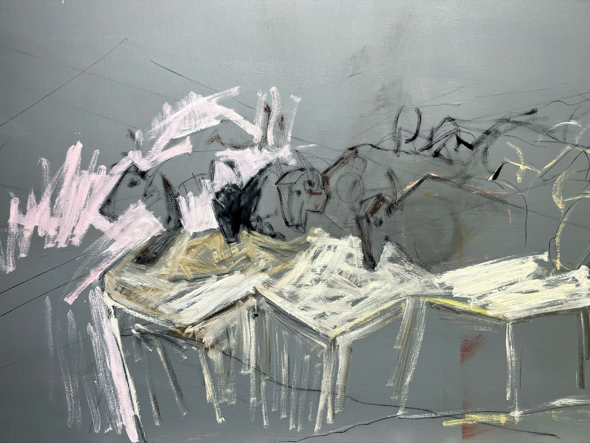
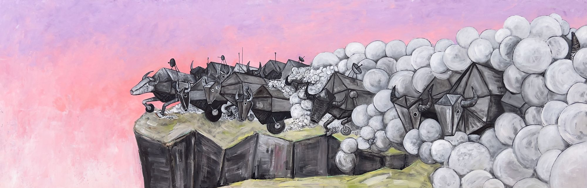

+++
title = "cyclic repetition"
date = 2021-12-18
category = "painting"
year = 2021
+++

cyclic repetition by kyle parker cunningham

The sacrifice of the drone bison.

*A future some days in front of us unfolding as echos we just now begin to hear.*

The bison have passed into the sunset.
We missed them, so we brought them back as robots.
They roamed again, autonomously.
Year after year after year.
Forever present on our plains immortal.

The chips we use to make life work disappeared.
Shortage of the futuristic decision makers.
Little chips, silicon wafers, future memories.
We needed these chips, the world could not function.
Primitive reality of a broken future.

Chips are scavenged for years, dug from the ground.
Pried from the waste of the past.
Pried from the most recently gizmo.
And then there too were no more chips.

Remembering the bison, scouts set out on foot.
Vast herds of these analogs were found in the prairie.
A seemingly endless supply of direly needed chips.
And so they are hunted again, succumbing to the oldest techniques.
Tumbling from great heights to utter destruction.
Chips carefully collected.

