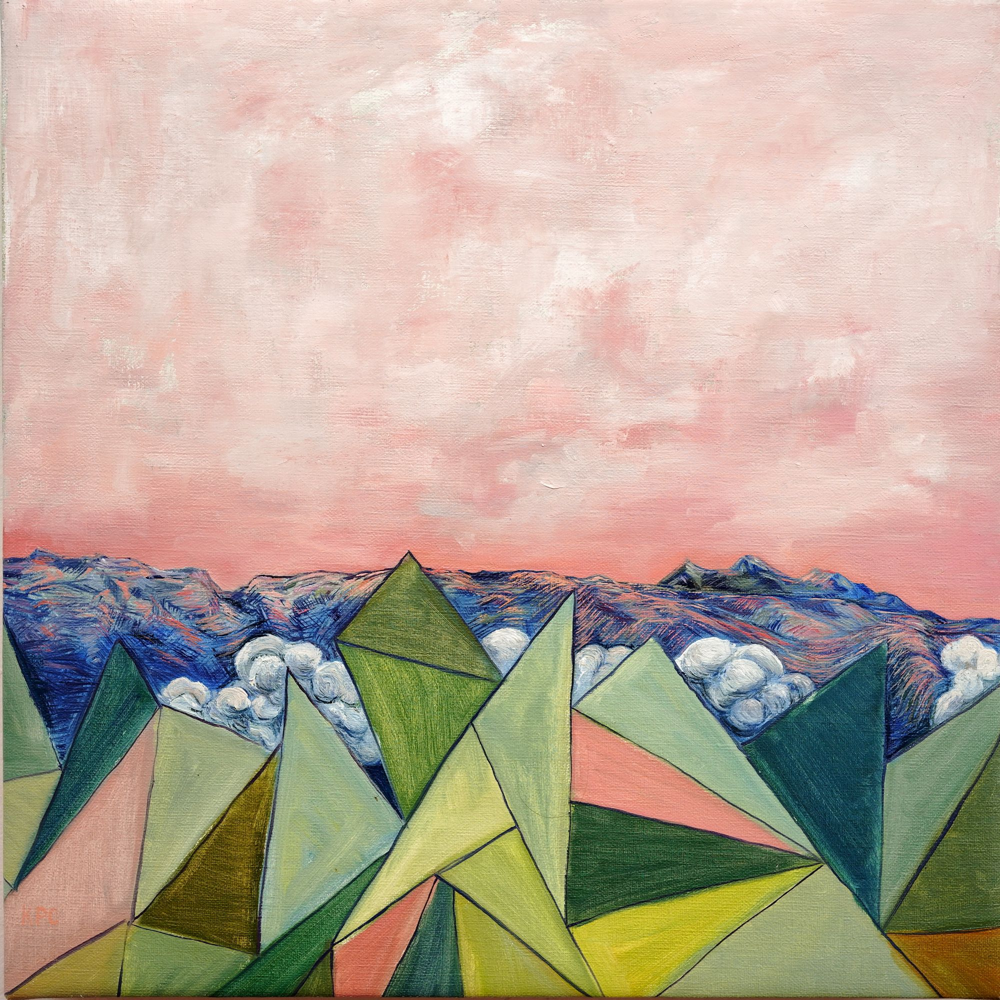

+++
title = "above the clouds"
date = 2024-07-29
category = "painting"
year = 2024
+++

above the clouds by kyle parker cunningham

Tres Piedras, New Mexico looks out to the east over the great expanse which is the Taos Gorge valley. The clouds often sit low out there above the Rio Grande Rift weaving through those ancient volcanoes and from this vantage point tucked up just a bit into the tree line - you feel as though you are above the clouds.

