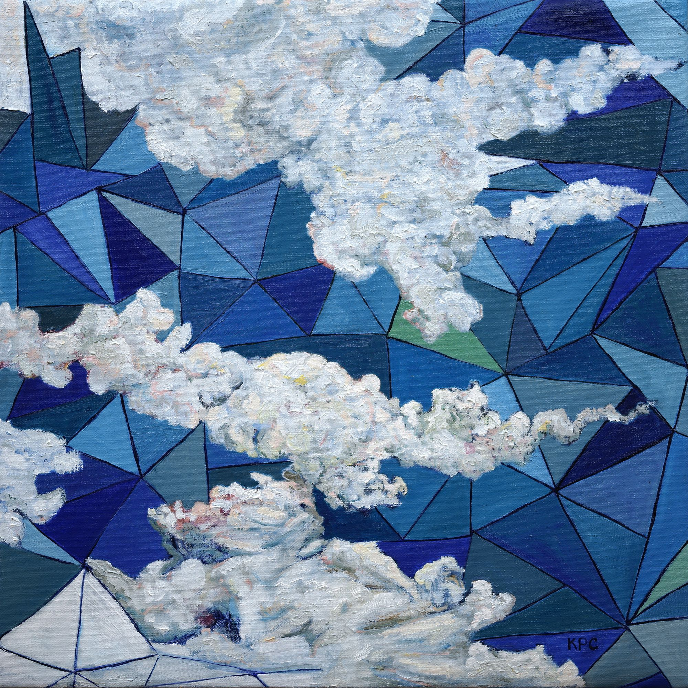

+++
title = "the algebra of water vapor"
date = 2024-07-29
category = "painting"
year = 2024
+++

the algebra of water vapor by kyle parker cunningham

Clouds as mathematical equations, water vapor solving for x in the vast blue sky, where nature meets abstract calculation.

