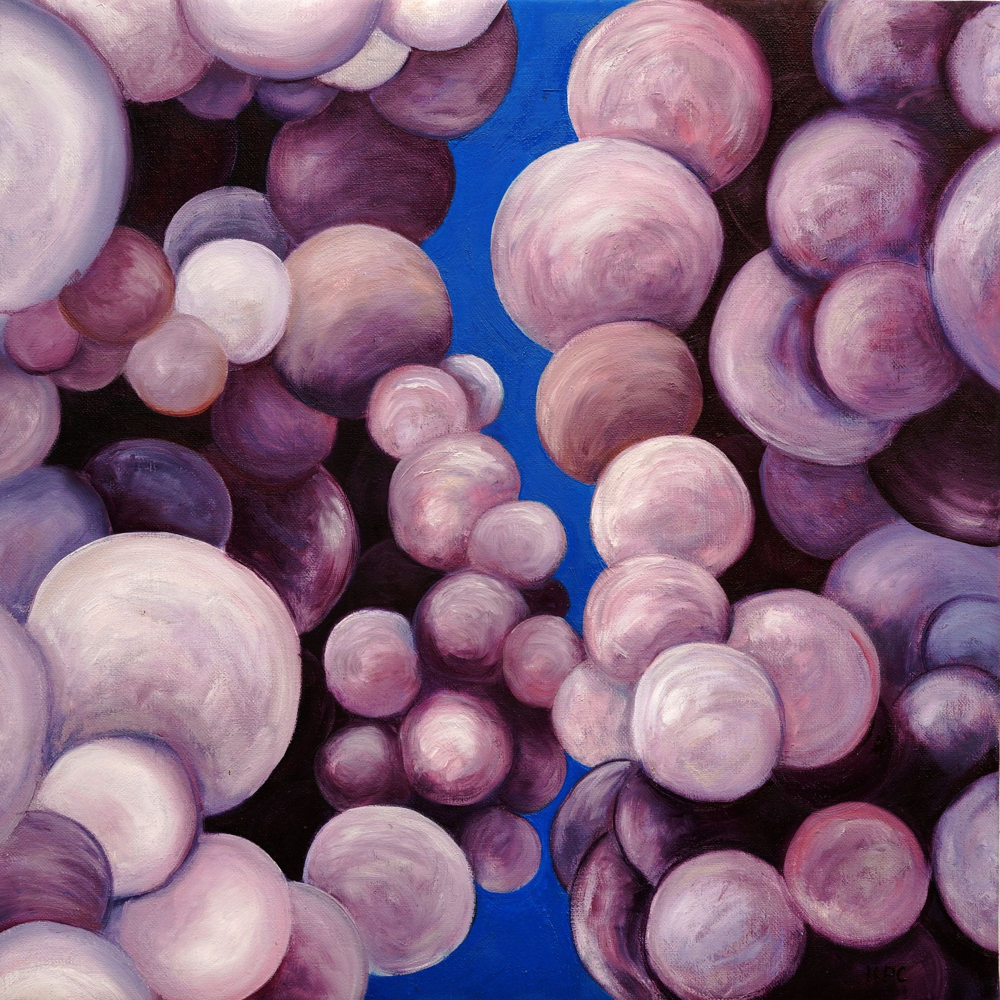

+++
title = "the river in the sky"
date = 2024-07-29
category = "painting"
year = 2024
+++

the river in the sky by kyle parker cunningham

Magic is the transportation of millions of gallons of water over thousands of miles in the rivers of the atmosphere. Each molecule of water drifts aimlessly on a cyclical pilgrimage to the tops of the mounts only to erode their way back to the melting pot of the oceans.

And then again upwards over the mountain.

Time moves forward and my memory grows long, so long those choice memories of the past are now but impressions of emotion. Erosion of forms. Elongation of acceptance. Pronunciation of the winds.

